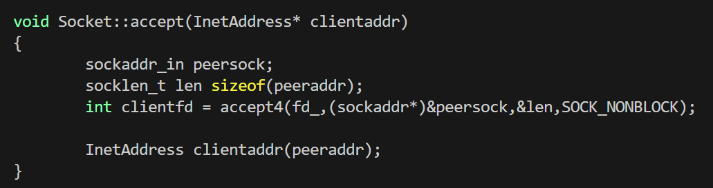
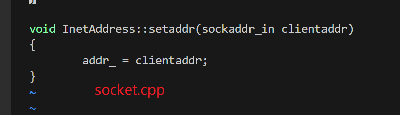
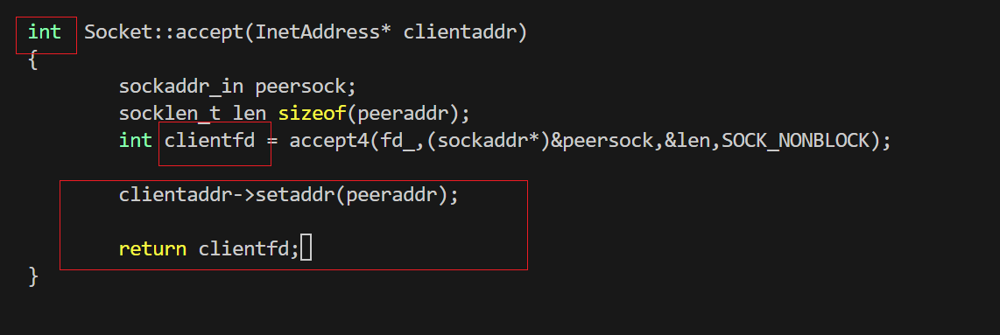
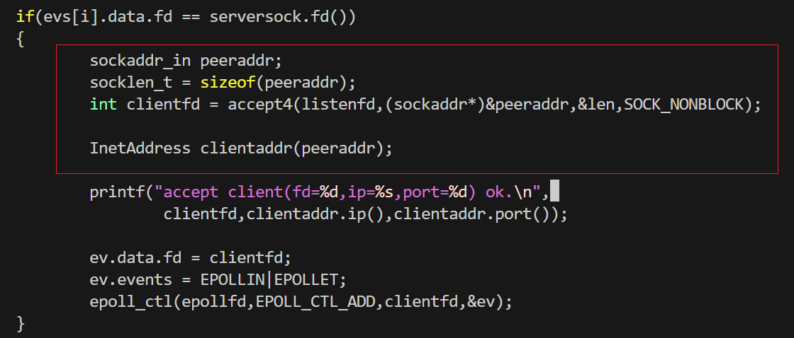
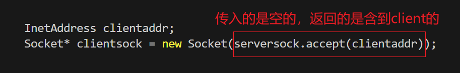

## 增加`Socket`类

新增：`Socket.h`和`Socket.cpp`

本次改动的作用：（（

* 封装与`socketfd`相关的函数，如`bind`、`listenfd `、`accept`等


1. 以下函数有`Socket::bind()`与`::bind()`两个函数,区别？

   ```cpp
   void Socket::bind(const InetAddress& serveraddr){
           if(::bind(fd_,serveraddr.addr(),sizeof(sockaddr))<0)
           {
                   perror("bind() faile");
                   close(fd_);
                   exit(-1);
           }
   }
   ```

   * `::bind()`：使用全局作用域里的 bind() 函数
   * `Socket::bind()`：使用的是类Socket里定义的`bind()`，这就是作用域::起的作用


2. 为啥像`addr_ \ fd_`放在私有变量里，然后在public里定义获取函数？为啥不直接放在`public`里
   * 保证变量不会被任意修改，只会被拿来使用
3. 为什么会回头在`InetAddress.h`里加一个函数，功能是接受外界传进的addr，把他设置为成员变量



这一个是Socket里的accept成员函数初始状态(刚从tcpepoll.cpp里复制过来，未修改)，除了将listenfd参数改为成员变量fd_之外，还有：
我们传进来的是`InetAddress*`类，目的是把`accept`接受到的客户端信息传入这个类，也就是需要修改这个类，但看源码，我们是在`Socket::accept()`里新建了一个`Inetaddress`类，而不是修改的传进来的，因此此处需要修改，直接将`peeraddr`放入传进来的类里，但是，在`InetAddress`成员函数里，没有这个功能的函数，因此添加，因此需要动`InetAddress.h`的内容，修改结果如下：




这里同时修正了返回值，应该为int

4. 在修改最终回头修改`tcpepoll.cpp`的时候，除了修改监听fd相关代码外，还需要修改客户端连上的fd代码块

   

这里有调整，因为需要传入空的`clientaddr`，但是`InetAddress`又没有空构造，因此需要再次调整`InetAddress.h`的内容

修改后为：



* `socket.h`

```cpp
#pragma once
#include<sys/types.h>
#include<sys/socket.h>
#include<netinet/tcp.h>
#include<string.h>
#include<errno.h>
#include<unistd.h>
#include"InetAddress.h"

// 声明非阻塞监听socket函数的创建，返回fd(属于创建socket)
/* 
这里有一个细节，为什么把crate_socket单独拿出来，创建完socket，返回fd,而不是直接在构造函数里create_socket呢，因为不统一，那样的话就需要写两个构造，因为除了服务器创建的listenfd之外，还有clientfd,这个是通过accept而非socket()创建的
因此，我们直接在构造函数外创建好不同的fd（listenfd,clientfd）,然后传入构造函数即可

*/
int createnonblocking();

class Socket
{
private:
        // Socket 持有的fd,在构造函数中传递进来
        const int fd_;
public:
        // 构造函数，传入已准备好的fd
        Socket(int fd);
        // 析构函数，关闭fd_
        ~Socket();

		// 获取私有成员变量fd_的函数
        int fd() const;
        // 设置setsocket选项
        void setreuseaddr(bool on);
        void setreuseport(bool on);
        void settcpnodelay(bool on);
        void setkeepalive(bool on);
    	// 此处的传进去的类只是绑定作用，不会修改，因此加const
        void bind(const InetAddress& serveraddr);
    	// 这里直接默认传参是128,即可以传空参数
        void listen(int nn=128);
    	// 因为传回的类是修改后的，因此不能加 const
        int accept(InetAddress& clientaddr);
};
```

* `Socket.cpp`

```cpp
#include"Socket.h"
int createnonblocking(){
        int listenfd = socket(AF_INET,SOCK_STREAM|SOCK_NONBLOCK,IPPROTO_TCP);
        if(listenfd < 0){
                // perror("socket() failed");
                // 用更详细的打印方式：文件名、函数名、行号、错误代码都显示出来
                printf("%s:%s:%d listen socket create error:%d\n",__FILE__,__FUNCTION__,__LINE__,errno);
                exit(-1);
        }
        return listenfd;
}

Socket::Socket(int fd):fd_(fd){}
// 析构函数，里面补充关闭文件
Socket::~Socket(){
        ::close(fd_);
}
int Socket::fd() const
{
        return fd_;
}

// 以下四个只要on是true,就会执行
void Socket::settcpnodelay(bool on){
        int optval = on?1:0;
        ::setsockopt(fd_,IPPROTO_TCP,TCP_NODELAY,&optval,sizeof(optval));
}
void Socket::setreuseaddr(bool on){
        int optval = on?1:0;
        ::setsockopt(fd_,SOL_SOCKET,SO_REUSEADDR,&optval,sizeof(optval));
}
void Socket::setreuseport(bool on){
        int optval = on?1:0;
        ::setsockopt(fd_,SOL_SOCKET,SO_REUSEPORT,&optval,sizeof(optval));
}
void Socket::setkeepalive(bool on){
        int optval = on?1:0;
        ::setsockopt(fd_,SOL_SOCKET,SO_KEEPALIVE,&optval,sizeof(optval));
}

// 绑定socketfd(是类Socket的成员变量) 与 sockaddr(是类InetAddress的成员变量)
// 在此类里可以直接取到fd_,但不可拿到addr_,需要传入类，并通过公有函数获取
void Socket::bind(const InetAddress& serveraddr){
        if(::bind(fd_,serveraddr.addr(),sizeof(sockaddr))<0)
        {
                perror("bind() faile");
                close(fd_);
                exit(-1);
        }
}

void Socket::listen(int nn)
{
        if(::listen(fd_,nn)!=0)
        {
                perror("listen() failed");
                close(fd_);
                exit(-1);
        }
}
// 这里返回的是客户端的文件描述符（同时内部修改了结构体InetAddress,加入来连接的client元素）
int Socket::accept(InetAddress& clientaddr)
{
        sockaddr_in peeraddr;
        socklen_t len = sizeof(peeraddr);
        int clientfd = accept4(fd_,(sockaddr*)&peeraddr,&len,SOCK_NONBLOCK);
        clientaddr.setaddr(peeraddr);
        return clientfd;
}
```

* `InetAddress.h`

```cpp
#pragma once 
#include<arpa/inet.h>
#include<netinet/in.h>
#include<string>

class InetAddress
{
private:
        sockaddr_in addr_;

public:
        // 新增空的构造函数（因为会使用）
        InetAddress();
    
        InetAddress(const std::string &ip,uint16_t port);
        InetAddress(const sockaddr_in addr);
        ~InetAddress();

        const char* ip() const;
        uint16_t port() const;
        const struct sockaddr *addr() const;

        // 补充：设置addr_成员的值，在Socket.cpp的accpet里会用到
    	// 同样，这里addr_是私有成员变量，如果想修改需要借助public里的函数
        void setaddr(const sockaddr_in& clientaddr);

};
```

* `InetAddress.cpp`

```cpp
#include "InetAddress.h"

InetAddress::InetAddress(){}

InetAddress::InetAddress(const std::string &ip,uint16_t port){
        addr_.sin_family = AF_INET;
        addr_.sin_port = htons(port);
        inet_pton(AF_INET,ip.c_str(),&addr_.sin_addr);
}

InetAddress::InetAddress(const sockaddr_in addr):addr_(addr){}

InetAddress::~InetAddress(){}

const char* InetAddress::ip() const{
        return inet_ntoa(addr_.sin_addr);
}

uint16_t InetAddress::port() const{
        return ntohs(addr_.sin_port);
}

const struct sockaddr* InetAddress::addr() const{
        return (sockaddr*)&addr_;
}

// 补充新设置的内容
void InetAddress::setaddr(const sockaddr_in& clientaddr)
{
        addr_ = clientaddr;
}
```

* `tcpepoll.cpp`

```cpp
#include<stdio.h>
#include<unistd.h>
#include<stdlib.h>
#include<string.h>
#include<errno.h>
#include<sys/socket.h>
#include<sys/types.h>
#include<arpa/inet.h>
#include<sys/fcntl.h>
#include<sys/epoll.h>
#include<netinet/tcp.h>
#include"InetAddress.h"
#include"Socket.h"

int main(int argc,char *argv[]){
	if(argc!=3){
		printf("usage:./tcpepoll ip port\n");
		printf("example:./tcpepoll 192.168.150.128 5085\n\n");
		return -1;
	}
	
	// 创建类，createnonblocking()内为socket(),返回的listenfd
    Socket serversock(createnonblocking());
	// 加入连接信息
	InetAddress serveraddr(argv[1],atoi(argv[2]));
	// 设置
	serversock.setreuseaddr(true);
	serversock.settcpnodelay(true);
	serversock.setreuseport(true);
	serversock.setkeepalive(true);
	// 绑定
	serversock.bind(serveraddr);
	// 设置监听
	serversock.listen();
	// 以下的listenfd要替换为 serversock.fd(),在结构体里取得
	int epollfd = epoll_create(1);
	
	struct epoll_event ev;
	ev.data.fd=serversock.fd();
	ev.events=EPOLLIN;
	
	epoll_ctl(epollfd,EPOLL_CTL_ADD,serversock.fd(),&ev);
	
	epoll_event evs[1024];
	
	while(true){
		int infds = epoll_wait(epollfd,evs,1024,-1);
		if(infds<0){
			perror("infds");
			exit(-1);
		}
		if(infds==0){
			perror("infds");
			continue;
		}
		
		for(int i=0;i<infds;i++){
			if(evs[i].events & EPOLLRDHUP){
				printf("client(eventfd=%d) disconnected.\n",evs[i].data.fd);
				close(evs[i].data.fd);
			}
			else if(evs[i].events & (EPOLLIN|EPOLLPRI)){
				if(evs[i].data.fd==serversock.fd()){
					/*
						struct sockaddr_in peeraddr;
						socklen_t len = sizeof(peeraddr);
						int clientfd = accept4(listenfd,(struct sockaddr*)&peeraddr,&len,SOCK_NONBLOCK);
					*/
					// 利用新增的构造函数，得到空的clientaddr
					InetAddress clientaddr;
					// new一个指针
					Socket *clientsock = new Socket(serversock.accept(clientaddr));
					
					printf("accept client(fd=%d,ip=%s,port=%d) ok.\n",clientsock->fd(),clientaddr.ip(),clientaddr.port());
					
					ev.data.fd = clientsock->fd();
					ev.events = EPOLLIN|EPOLLET;
					epoll_ctl(epollfd,EPOLL_CTL_ADD,clientsock->fd(),&ev);
				}
				else{
					char recv_buf[1024];
					while(true){
						bzero(&recv_buf,sizeof(recv_buf));
						ssize_t nread = read(evs[i].data.fd,recv_buf,sizeof(recv_buf));
						if(nread>0){
							printf("recv(eventfd=%d):%s\n",evs[i].data.fd,recv_buf);
							write(evs[i].data.fd, recv_buf, nread);
						}
						else if(nread == -1 && errno == EINTR){
							continue;
						}
						else if(nread == -1 &&((errno == EAGAIN)||(errno == EWOULDBLOCK))){
							break;
						}
						else if(nread == 0){
							printf("client(eventfd=%d) disconncted.\n",evs[i].data.fd);
							close(evs[i].data.fd);
							break;
						}
					}
				}
			}
			else if(evs[i].events & EPOLLOUT){
			}
			else{
				printf("client(eventfd=%d) error.\n",evs[i].data.fd);
				close(evs[i].data.fd);
			}
		}
	}
	return 0;
}
```

