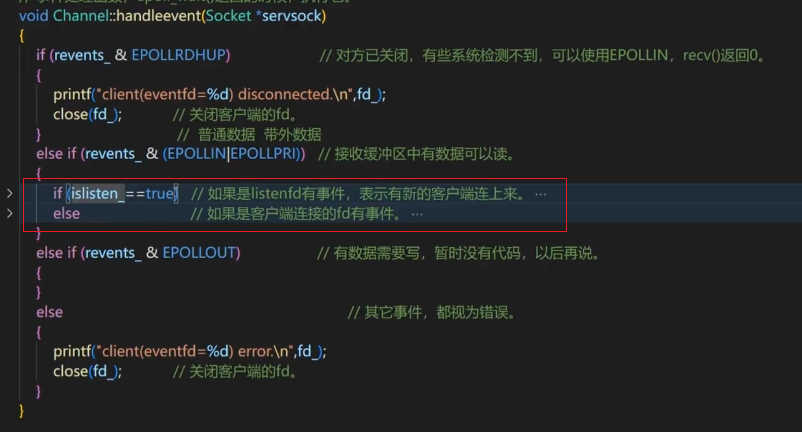
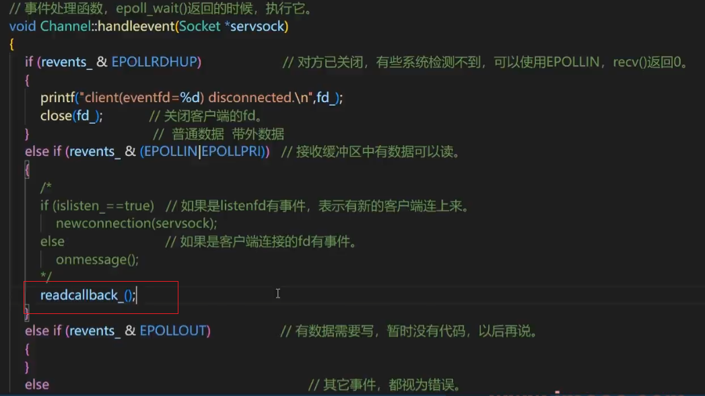
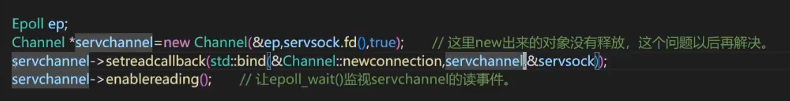
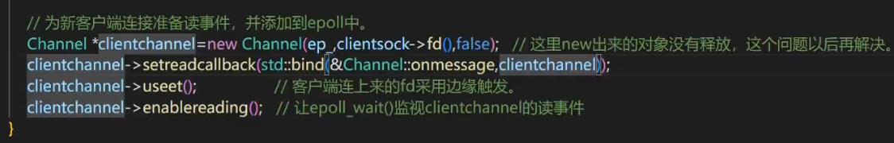

## 用C++11的function实现函数回调

调整如下代码，使其不被写死，实现定制功能，源码为传统编程思路，判断+执行完全固定，因此改为回调代码



调整方式：
单独写两个函数，对应源码的`if/else`的执行内容

```cpp
void newconnection(Socket* serversock); // 处理新客户端连接请求
void onmessage();             // 处理对端发送过来的消息
```


然后采用回调函数的方法，增加回调函数的成员变量，类型为void，参数列表设置空，再设置操作回调函数的成员函数，方便设置成员变量--回调函数，函数体很简单，对成员变量回调函数赋值即可

```cpp
// fd_读事件的回调函数
std::function<void()>readcallback_;

// 设置fd_读事件的回调函数
void setreadcallback(std::function<void()>fn); 

// 成员函数的内容：（作用是设置回调函数(私有成员变量)）
void Channel::setreadcallback(std::function<void()> fn)
{
        readcallback_ = fn;
}
```


下一步，修改事件处理函数，设置替换为回调函数



然后修改`tcpepoll.cpp`内，在创建Channel类对象的时候，要指定类的回调函数，对于服务端来说，创建的`channel`属于新连接(目前有新连接选项和处理消息选项)，因此绑定成员函数`Channel::newconnection()`，灵活就体现在此，可以自己随意设置固定，在`Channel`框架内，统一空调用就能实现自己外部设置的不同功能

注意传入参数，与`newconnection`需要参数相关，具体如下：




参数1：绑定该channel对应发生的成员函数（要做什么事）
参数2：填对象的地址（谁来做这件事 / this 指针）
参数3：newconnection所需要的参数（做这件事需要什么材料）

 ```cpp
 std::bind(
     函数地址,      // 第1个位置：必须是“你要调用的函数”
     对象指针,      // 第2个位置：必须是“this指针”（谁来调用这个函数）
     函数的参数1,   // 第3个位置：必须是函数的第一个参数
     函数的参数2,   // 第4个位置：必须是函数的第二个参数
     ...
 );
 ```


同时，客户端有新连接时，也需要同样操作（只是bind传参不同）,客户端的回调函数是`onmessage()`



这里面传对象指针的时候，为什么穿的不是`this`?因为这本身就是在`channel`类里写的成员函数

：**因为处理“发来的消息”这个任务的对象，不是当前的 `Server Channel`（也就是 this），而是刚刚创建出来的那个 `Client Channel`**。

那怎么确定当前是`Server Channel`的呢？因为如果发生`newconnection()`这段成员函数，那一定是有新的`accept()`连接到新客户端，也就是`Server`端发生的事件


这时就已经实现回调的目的了，之后做一些优化，删除不必要的内容:
成员变量 `islisten_`，不再使用，因此剔除，同时`Channel`构造函数也需要同步修改，在`new Channel`时，也需要对应修改一下，最终得到修改后的程序：

为啥`islisten_`不需要了呢？那在哪里做判断？

在 `new Channel()`的后一行，设置它的成员变量的时候`setreadcallback()`会把区分`islisten_`的信息加上，其实跳过了这一步判断，而是直接调用对应的回调函数，这也是回调函数的优势


* `tcpepoll.cpp`

```cpp
#include<stdio.h>
#include<unistd.h>
#include<stdlib.h>
#include<string.h>
#include<errno.h>
#include<sys/socket.h>
#include<sys/types.h>
#include<arpa/inet.h>
#include<sys/fcntl.h>
#include<sys/epoll.h>
#include<netinet/tcp.h>
#include"InetAddress.h"
#include"Socket.h"
#include"Epoll.h"

int main(int argc,char *argv[]){
	if(argc!=3){
		printf("usage:./tcpepoll ip port\n");
		printf("example:./tcpepoll 192.168.150.128 5085\n\n");
		return -1;
	}

	Socket serversock(createnonblocking());
	InetAddress serveraddr(argv[1],atoi(argv[2]));
	serversock.setreuseaddr(true);
	serversock.settcpnodelay(true);
	serversock.setreuseport(true);
	serversock.setkeepalive(true);
	serversock.bind(serveraddr);
	serversock.listen();

	Epoll ep;

	Channel *serverchannel = new Channel(&ep,serversock.fd());

	// 传进去
	serverchannel->setreadcallback(std::bind(&Channel::newconnection,serverchannel,&serversock));

	serverchannel->enablereading();


	while(true){
		std::vector<Channel *> channels = ep.loop();

		for(auto &ch:channels)
		{
			ch->handle_event();
		}
	}
	return 0;
}
```

* `Channel.h`

```cpp
#pragma once
#include<sys/epoll.h>
#include<functional>
#include"Epoll.h"
#include"InetAddress.h"
#include"Socket.h"

class Epoll;

class Channel
{
private:
	int fd_;
	Epoll *ep_ = nullptr;
	bool inepoll_ = false;
	uint32_t events_ = 0;
	uint32_t revents_ = 0;

	// fd_读事件的回调函数
	std::function<void()>readcallback_;

	// bool islisten_=false;

public:
	Channel(Epoll *ep,int fd);
	~Channel();

	int fd();
	void useet();
	void enablereading();
	void setinepoll();
	void setrevents(uint32_t ev);
	bool inepoll();
	uint32_t events();
	uint32_t revents();
	void handle_event();

	void newconnection(Socket* serversock); // 处理新客户端连接请求
	void onmessage();                       // 处理对端发送过来的消息

	void setreadcallback(std::function<void()>fn);  // 设置fd_读事件的回调函数
};
```

* `Channel.cpp`

```cpp
#include"Channel.h"

Channel::Channel(Epoll* ep,int fd):ep_(ep),fd_(fd)
{

}

Channel::~Channel()
{
	// 不能销毁ep_,也不能关闭fd,因为这是从外面传进来的，不是自己创建的，Channel只是使用它们
}

int Channel::fd()
{
	return fd_;
}

void Channel::useet()
{
	events_ = events_|EPOLLET;
}

void Channel::enablereading()
{
	events_ = events_|EPOLLIN; // 修改事件，注意设定方式，要用|
	ep_->updatechannel(this);
}
void Channel::setinepoll()
{
	inepoll_ = true;
}

void Channel::setrevents(uint32_t ev)
{
	revents_ = ev;
}

bool Channel::inepoll()
{
	return inepoll_;

}

uint32_t Channel::events()
{
	return events_;
}

uint32_t Channel::revents()
{
	return revents_;
}

void Channel::handle_event()
{
	if(revents_ & EPOLLRDHUP)
	{
		printf("client(eventfd=%d) disconnected.\n",fd_);
		close(fd_);
	}
	else if(revents_ & (EPOLLIN|EPOLLPRI))
	{
		/*
		// 此处之后，islisten_无用了
		if(islisten_ == true)
		{
			newconnection(serversock);
		}
		else
		{
			onmessage();
		}
		*/
		// 改为调用回调函数
		readcallback_();
	}
	else if(revents_ & EPOLLOUT)
	{
	}
	else
	{
		printf("client(eventfd=%d error.\n",fd_);
		close(fd_);
	}
}

// 新增
void Channel::newconnection(Socket* serversock)
{
	InetAddress clientaddr;
	Socket *clientsock = new Socket(serversock->accept(clientaddr));
	printf("accept cleint(fd=%d,ip=%s,port=%d)ok.\n",clientsock->fd(),clientaddr.ip(),clientaddr.port());

	Channel *clientchannel = new Channel(ep_,clientsock->fd());
	// 设置客户端的回调函数
	clientchannel->setreadcallback(std::bind(&Channel::onmessage,clientchannel));

	clientchannel->useet();
	clientchannel->enablereading();
}
// 新增
void Channel::onmessage()
{
	char buffer[1024];
	while(true)
	{
		bzero(&buffer,sizeof(buffer));
		ssize_t nread = read(fd_,buffer,sizeof(buffer));
		if(nread>0)
		{
			printf("recv(eventfd=%d):%s\n",fd_,buffer);
			send(fd_,buffer,strlen(buffer),0);
		}
		else if(nread == -1 && errno == EINTR)
		{
			continue;
		}
		else if(nread == -1 && ((errno == EAGAIN)||(errno == EWOULDBLOCK)))
		{
			break;
		}
		else if(nread==0)
		{
			printf("client(eventfd=%d)disconnected.\n",fd_);
			close(fd_);
			break;
		}
	}
}

void Channel::setreadcallback(std::function<void()> fn)
{
	readcallback_ = fn;
}
```