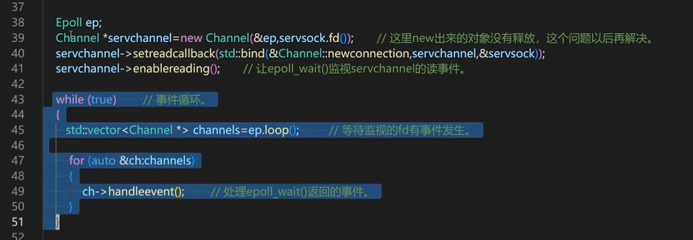
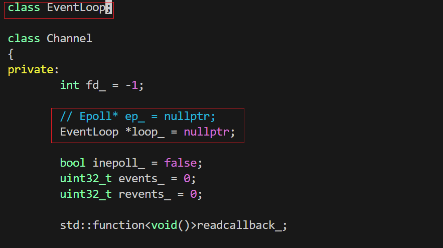

此步骤比较简单，只是封装了一个Epoll创建和的循环部分，修改内容如下：


建`EventLoop.h / EventLoop.cpp`这俩文档，成员变量自然是`Epoll`类，类的话，如果只能用一个变量表示，那会是什么？--指针，因此是`Epoll*`，另外，外界会调用，因此要设置一个成员函数，可以调用这个函数间接拿到私有成员`Epoll*`，以下是修改的代码：

* `EventLoop.h`

```cpp
#pragma once
#include"Epoll.h"

class EventLoop
{
private:
	Epoll *ep_;     // 每个事件循环只有一个Epoll

public:
	EventLoop();    // 在构造函数中创建Epoll对象ep_
	~EventLoop();   // 在析构函数中销毁ep_

	void run();     // 运行事件循环
	Epoll *ep();    // 返回ep_的地址，用于调用
};
```

* `EventLoop.cpp`

```cpp
EventLoop::EventLoop():ep_(new Epoll)
{

}

EventLoop::~EventLoop()
{
	delete ep_;
}

void EventLoop::run()
{
	while(true)
	{
		std::vector<Channel*> channels = ep_->loop();

		for(auto &ch:channels)
		{
			ch->handle_event();
		}
	}
}

Epoll* EventLoop::ep()
{
	return ep_;
}
```

* `tcpepoll.cpp`

```cpp
#include<stdio.h>
#include<unistd.h>
#include<stdlib.h>
#include<string.h>
#include<errno.h>
#include<sys/socket.h>
#include<sys/types.h>
#include<arpa/inet.h>
#include<sys/fcntl.h>
#include<sys/epoll.h>
#include<netinet/tcp.h>
#include"InetAddress.h"
#include"Socket.h"
#include"Epoll.h"
#include"EventLoop.h"

int main(int argc,char *argv[]){
	if(argc!=3){
		printf("usage:./tcpepoll ip port\n");
		printf("example:./tcpepoll 192.168.150.128 5085\n\n");
		return -1;
	}

	Socket serversock(createnonblocking());
	InetAddress serveraddr(argv[1],atoi(argv[2]));
	serversock.setreuseaddr(true);
	serversock.settcpnodelay(true);
	serversock.setreuseport(true);
	serversock.setkeepalive(true);
	serversock.bind(serveraddr);
	serversock.listen();

	// Epoll ep;
	EventLoop loop;

	Channel *serverchannel = new Channel(loop.ep(),serversock.fd());
	serverchannel->setreadcallback(std::bind(&Channel::newconnection,serverchannel,&serversock));
	serverchannel->enablereading();

	// 运行事件循环
	loop.run();
	/*
	while(true){
		std::vector<Channel *> channels = ep.loop();
		
		for(auto &ch:channels)
		{
			ch->handle_event();     
		}
	}
	*/
	return 0;
}
```


最后优化：


修改前：

Channel ----直接控制----> Epoll
(Channel 权力过大，且无法使用 Loop 的高级功能)


修改后变为：

Channel ----委托----> EventLoop ----控制----> Epoll

为后续：使用 EventLoop 提供的**线程安全保护**、**异步任务队列**和**定时器服务**等做准备


把 `Channel`类里的成员变量`Epoll* `改为`EventLoop* `,也就是将Epoll完全包装起来，同样也是方便以后调用
