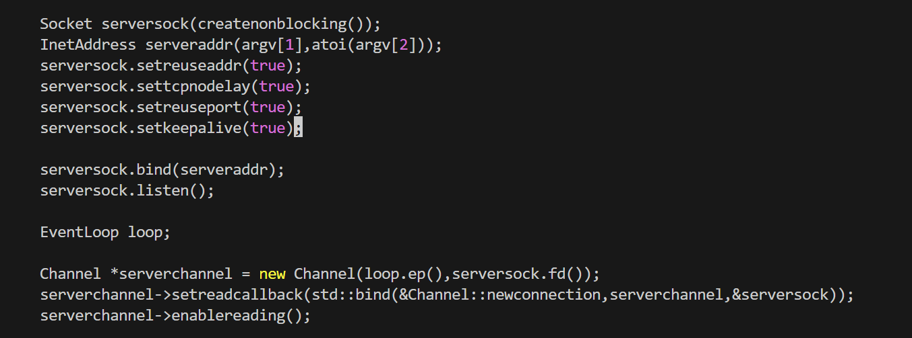
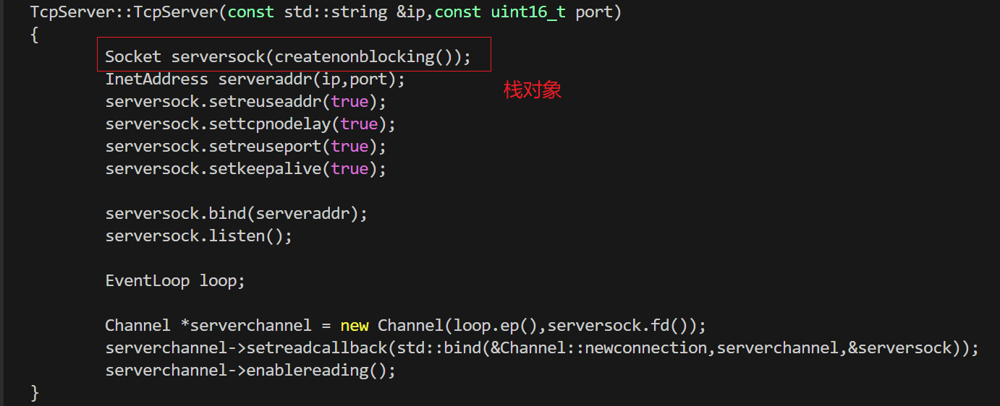

# 把服务端封装成TcpServer类


本次封装的是`tcpepoll.cpp`里的以下部分内容：



### 遇到问题一(serversock是栈对象，但是要用堆对象，要new出来)：

源代码程序：



**栈对象（Stack Object）在其所在的大括号 `}` 结束时会自动销毁。**

为什么在 `main` 函数栈对象里没问题，而在 `TcpServer` 构造函数里需要改为堆？

#### 1. 核心机制：Socket 的析构函数 (RAII)

你使用的 `Socket` 类通常遵循 RAII 原则。这意味着：
*   **构造时**：创建文件描述符（fd）。
*   **析构时**：调用 `close(fd)` 关闭文件描述符。

```cpp
// 伪代码示例
class Socket {
    int fd_;
public:
    ~Socket() {
        close(fd_); // <--- 关键点：对象销毁时，fd 会被关闭
    }
};
```

---

#### 2. 场景对比

##### 场景 A：之前在 `main` 函数中

```cpp
int main() {
    // serversock 是 main 函数的局部变量（栈对象）
    Socket serversock(createnonblocking()); 
    
    // ... 绑定、监听 ...
    
    EventLoop loop;
    loop.run(); // 死循环，程序一直停留在这里
    
    return 0; 
} // <--- main 函数结束，serversock 才会被析构
```

*   **生命周期**：`main` 函数是程序的入口。在 `main` 返回之前（即程序结束前），`serversock` 一直活着。
*   **结果**：只要服务器在运行，`serversock` 就不会被销毁，`fd` 就不会被关闭。所以没问题。

##### 场景 B：在 `TcpServer` 构造函数中（使用栈对象）

```cpp
TcpServer::TcpServer(const std::string &ip, const uint16_t port) {
    // serversock 是构造函数的“局部变量”（栈对象）
    Socket serversock(createnonblocking()); 
    
    // ... 绑定、监听 ...
    
    // 假设我们将 loop.run() 移出去，或者 Channel 需要长期持有这个 fd
    Channel *serverchannel = new Channel(loop.ep(), serversock.fd());
    
} // <--- 构造函数结束！
  // 1. serversock 离开作用域，调用析构函数 ~Socket()
  // 2. ~Socket() 执行 close(fd)
  // 3. 此时，操作系统层面的 socket 连接已断开
```

* **问题所在**：虽然 `Channel` 对象是在堆上 `new` 出来的（或者它是成员变量），它还活着，并且它记录了一个整数 `fd`（比如是 3）。但是，因为局部变量 `serversock` 离开了构造函数作用域被销毁了，**fd 3 已经被操作系统关闭了**。

* **后果**：当 `EventLoop` 尝试在 fd 3 上监听事件时，会报错（Bad file descriptor），或者更糟糕的是，fd 3 被其他新打开的文件复用了，导致逻辑错乱。

  

#### 3. 为什么要改成堆对象（或成员变量）？

为了让 `Socket` 对象的生命周期**不仅仅局限于构造函数内部**，而是跟 `TcpServer` 这个对象的生命周期一样长：

需要 `new` 出来，这样它就不会因为离开 `}` 而自动析构。**(后面会有其他改进，把他变为成员函数即可，使用智能指针)**

```cpp
// serversock 指针在栈上，但指向的对象在堆上
Socket *serversock = new Socket(createnonblocking());

// 构造函数结束时，serversock 指针变量消失了，但堆上的 Socket 对象还在
// 缺点：你必须找个地方把这个指针存起来（比如存入 Channel），否则就内存泄漏了，且无法析构关闭 fd
```


#### 4. 代码里另一个栈对象是 serveraddr,但是他为啥不用改为堆？

因为它的目标生命周期就在这一个代码块里，足够使用


具体代如下：

* `TcpServer.h`

```cpp
#pragma once
#include"EventLoop.h"
#include"Socket.h"
#include"Channel.h"

class TcpServer
{
private:
	EventLoop loop_;        // 一个TcpServer可以有多个事件循环，现在是单线程，暂时只用一个事件循环
public:
	TcpServer(const std::string &ip,const uint16_t port);
	~TcpServer();

	void start();           // 运行事件循环
};
```

* `TcpServer.cpp`

```cpp
#include"TcpServer.h"

TcpServer::TcpServer(const std::string &ip,const uint16_t port)
{
	// 这里的serversock是栈对象，但是要用堆对象，要new出来
	// 因为在Socket析构函数中会关闭fd,如果serversock是栈对象，当离开构造函数时，栈对象会被默认释放，导致服务端fd被关掉
	// Socket serversock(createnonblocking());
	Socket *serversock = new Socket(createnonblocking());
	InetAddress serveraddr(ip,port);
	serversock->setreuseaddr(true);
	serversock->settcpnodelay(true);
	serversock->setreuseport(true);
	serversock->setkeepalive(true);
	serversock->bind(serveraddr);
	serversock->listen();

	// 下面创建loop实际就是 TcpServer类的成员函数，已经在构造函数中创建好，可直接调用，无需重复创建
	// EventLoop loop;

	Channel *serverchannel = new Channel(&loop_,serversock->fd());
	serverchannel->setreadcallback(std::bind(&Channel::newconnection,serverchannel,serversock));
	serverchannel->enablereading();
}

TcpServer::~TcpServer()
{

}

void TcpServer::start()
{
	loop_.run();
}
```

* `tcpepoll.cpp`

```cpp
/*
#include<stdio.h>
#include<unistd.h>
#include<stdlib.h>
#include<string.h>
#include<errno.h>
#include<sys/socket.h>
#include<sys/types.h>
#include<arpa/inet.h>
#include<sys/fcntl.h>
#include<sys/epoll.h>
#include<netinet/tcp.h>
#include"InetAddress.h"
#include"Socket.h"
#include"Epoll.h"
#include"EventLoop.h"
*/


#include"TcpServer.h"
int main(int argc,char *argv[]){
	if(argc!=3){
		printf("usage:./tcpepoll ip port\n");
		printf("example:./tcpepoll 192.168.150.128 5085\n\n");
		return -1;
	}

	TcpServer tcpserver(argv[1],atoi(argv[2]));

	tcpserver.start();      // 运行事件循环 

	return 0;
}
```

上面删去了很多头文件，因为回头看代码，只于`TcpServer`类相关，因此只保留`"TcpServer.h"`即可，其他头文件都在这个头文件的内部包含，删去的目的只是为了清晰美观
