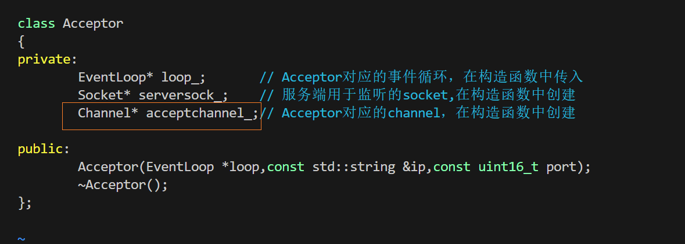
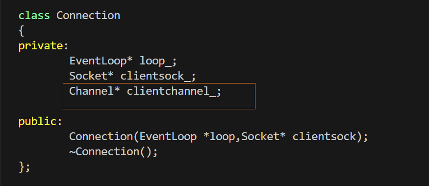
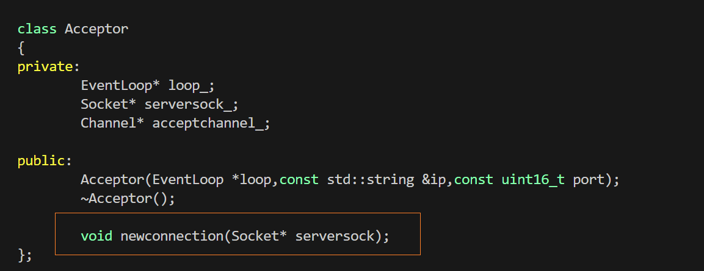
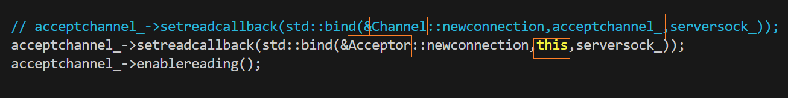
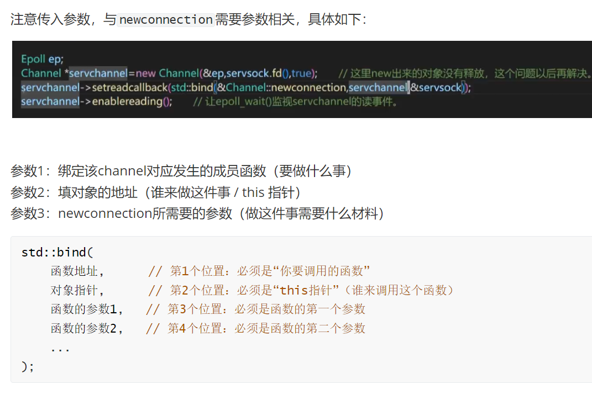
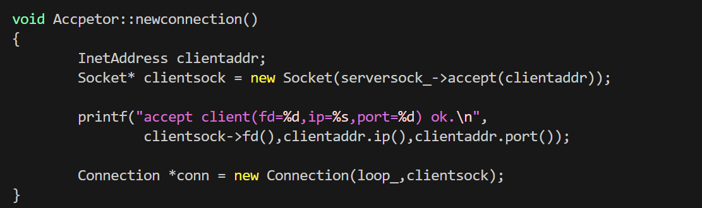

# 优化回调函数

上节写`Connection`类时，它创建的位置是`Channel`类里，但是，他们的关系是：
`Channel`类封装了`Connection`类和`Acceptor`类，如下：

`Channel`是`Connection`类和`Acceptor`类的下层类

创建新的连接，即`Connection`类，理论应该放在`Acceptor`里，而非`Channel`类内，之前放这里是因为方便，此时做出修正

即将`Channel::newconnection()`改为`Acceptor::newconnection()`

最后搬过来以后就修改细节：

* 在`Acceptor`类里添加`#icnlude"Connection.h"`头文件

* 把`Channel::`改为`Acceptor::`

* 由于`Acceptor`里有成员变量`Socket* serversock_`因此不必传参(注意修改回调函数，不用再固定参数了)

* 注意修改回调函数的对象指针

  

最终把成员函数修改为：
