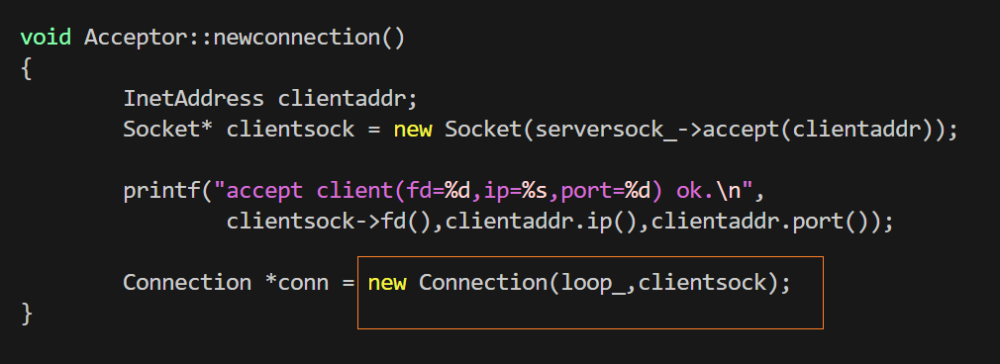
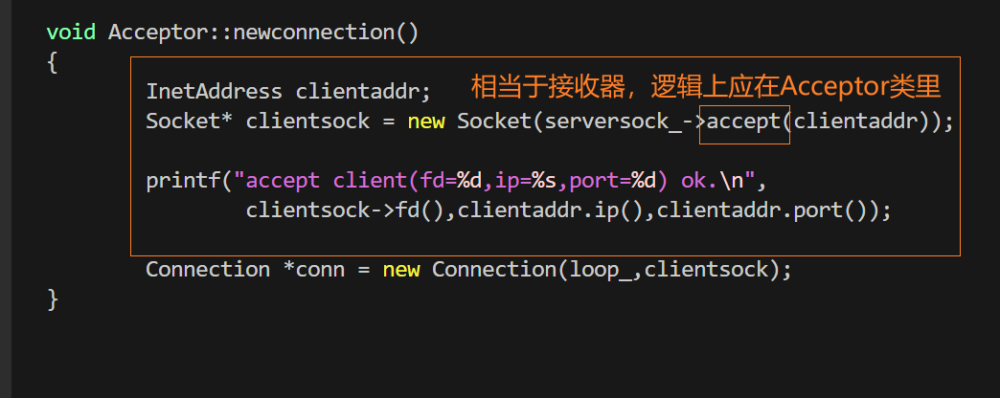
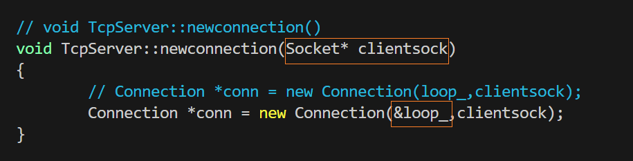
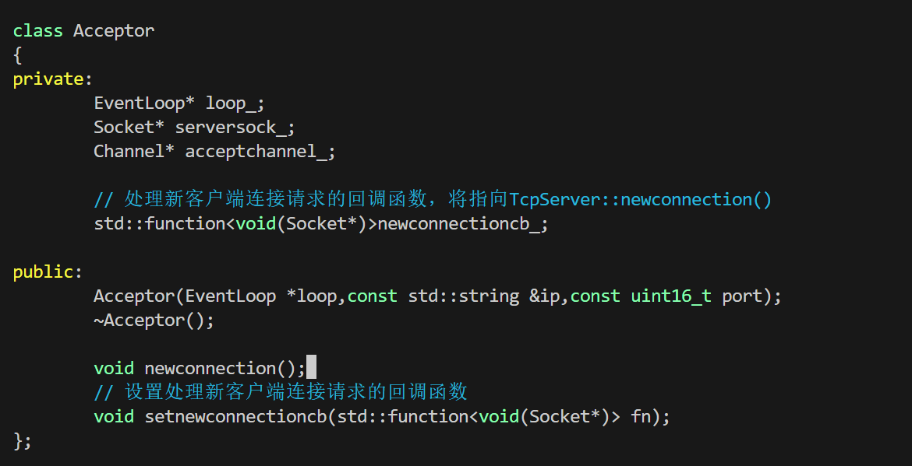
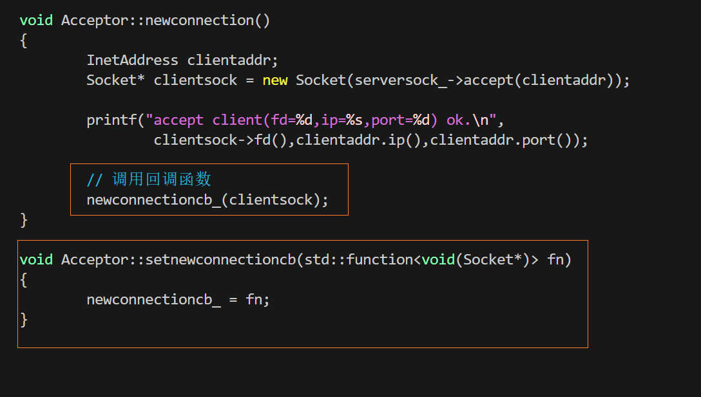
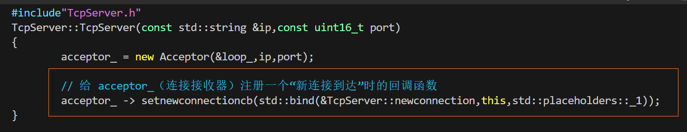
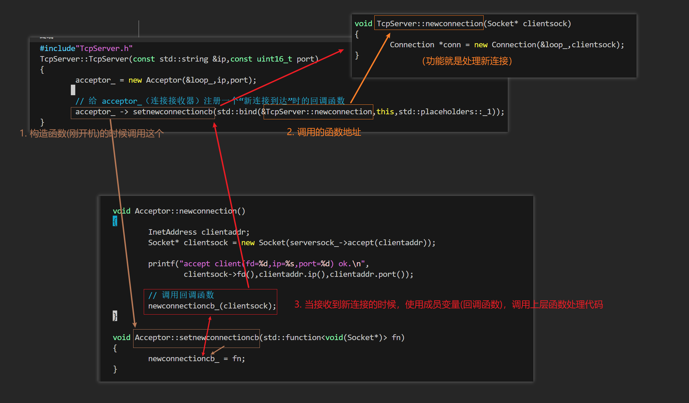

思考，`Connection`对象，应该由哪个类管理？是哪个类的对象？

到目前为止，`Connection`代码写的是在`Acceptor`类的成员函数里



在这里new的，而且没有销毁，因此要修改

修改为在`TcpServer`类里创建`Connection`，以成员函数的身份出现，但只需要转移一行即可，因为：


另外如果都转移过去，还要再传一个`Serversock_`（因为`TcpServer`没有这个成员函数），实在没必要

修改后的`TcpServer::newconnection()`如下，注意要传一个参数,因为没这个成员变量，注意`new Connection()`里，第一个参数传的应该指针，因此要取地址，因为`EventLoop Loop_`在`TcpServer`类里是栈对象,如下：




那么问题来了，在`Aacceptor`类中，怎么调用`TcpServer`类里的成员函数`newconnecion()`呢？采用回调函数的方式：

* 在`Acceptor`类里增加成员变量`std::function<void(Socket* )>newconnectioncb_;`
* 在`Acceptor`类里增加成员函数，用于设置成员函数---回调函数(刚设置的)



在`Acceptor.cpp`里做如下修改：



最后修改TcpServer类部分，在构造函数中，添加绑定：



注意，这里的`bind()`里，有一个占位参数`std::placeholders::_1`，等待调用的时候传入进来


最后依旧遗留了一个问题，就是在`TcpServer::newconnection()`里创建的`Connection`对象依旧没释放，之后处理


# 整个回调过程：




# 最后整个运行过程如下：


### 第一阶段：“埋雷” —— 注册回调链（初始化阶段）

在服务器启动、还没有客户端连接的时候，代码通过 `std::bind` 把各个层级连接了起来。

1. **TcpServer 给 Acceptor 注册回调：**
   在 `TcpServer` 的构造函数中：
   
   ```cpp
   acceptor_ -> setnewconnectioncb(std::bind(&TcpServer::newconnection, this, std::placeholders::_1));
   ```
   **大白话：** `TcpServer` 对 `Acceptor` 说：“老弟，你专门负责接客（接收新连接）。接客成功后，把你拿到的新客人的 `Socket` 交给我，也就是执行我的 `TcpServer::newconnection` 方法。”
   
2. **Acceptor 给 Channel 注册回调：**
   在 `Acceptor` 的构造函数中：
   ```cpp
   acceptchannel_->setreadcallback(std::bind(&Acceptor::newconnection, this));
   acceptchannel_->enablereading();
   ```
   **大白话：** `Acceptor` 拥有一个监听套接字（`serversock_`）和对应的事件分发器（`acceptchannel_`）。`Acceptor` 对 `Channel` 说：“当监听的 fd 发生**可读事件**（意味着有新客户端 connect 了），你就调用我的 `Acceptor::newconnection` 方法。”

**总结注册链：** 底层 `Channel` 知道去找 `Acceptor`，中层 `Acceptor` 知道去找上层 `TcpServer`。

---

### 第二阶段：“引爆” —— 新连接到达时的执行过程

当你在终端输入 `./tcpepoll` 并调用 `TcpServer::start()` (即 `loop_.run()`) 后，底层 `epoll_wait` 阻塞等待。此时，一个客户端发起连接，整个回调链瞬间启动，过程如下：

#### Step 1: Epoll 唤醒，Channel 分发事件
* 客户端发起三次握手成功。
* 服务器的监听套接字（`listenfd`）变为**可读**状态。
* `EventLoop` 中的 `epoll_wait` 返回，发现是 `acceptchannel_` 有事件。
* `Channel` 内部的 `handleEvent()` 被触发，它发现是读事件，于是**调用在构造时绑定的读回调函数**。

#### Step 2: 执行 `Acceptor::newconnection()`
这是接客的第一现场。`Channel` 调用了这层函数：
```cpp
void Acceptor::newconnection()
{
        InetAddress clientaddr;
        // 1. 调用系统API accept() 接受连接，得到通信fd，并包装成 Socket 对象
        Socket* clientsock = new Socket(serversock_->accept(clientaddr));

        // 2. 打印日志
        printf("accept client(fd=%d,ip=%s,port=%d) ok.\n", ...);

        // 3. 核心：调用回调函数把 Socket 传给上层
        newconnectioncb_(clientsock);
}
```
* **注意：** `Acceptor` 的职责非常单一，它只负责调用 `accept()` 把底层的 `fd` 捞出来，它**不负责**与这个客户端进行数据收发。捞出来之后，它立刻调用 `newconnectioncb_` 向长官报告。

#### Step 3: 执行 `TcpServer::newconnection(Socket* clientsock)`
刚才 `Acceptor` 调用的 `newconnectioncb_`，实际上就是 `TcpServer` 在初始化时绑定的函数。于是代码执行权跳到了这里：
```cpp
void TcpServer::newconnection(Socket* clientsock)
{
        // 创建一个 Connection 对象来专门管理这个新客户端的后续通信
        Connection *conn = new Connection(&loop_, clientsock);
}
```
* `TcpServer` 拿到了已经建立好的 `clientsock`。
* 它 `new` 了一个 `Connection` 对象。从这一刻起，**监听的工作继续交由 `Acceptor` 负责，而与这个新客户端的收发数据工作，则全权交给了新创建的 `Connection` 对象。**


