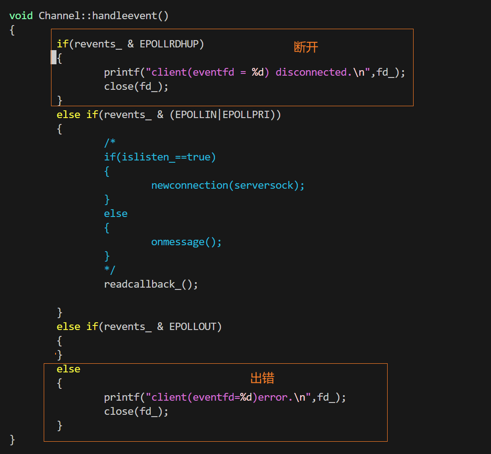
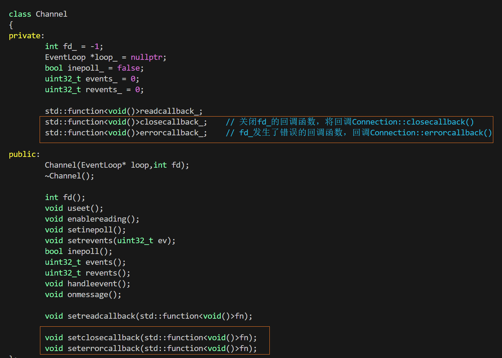
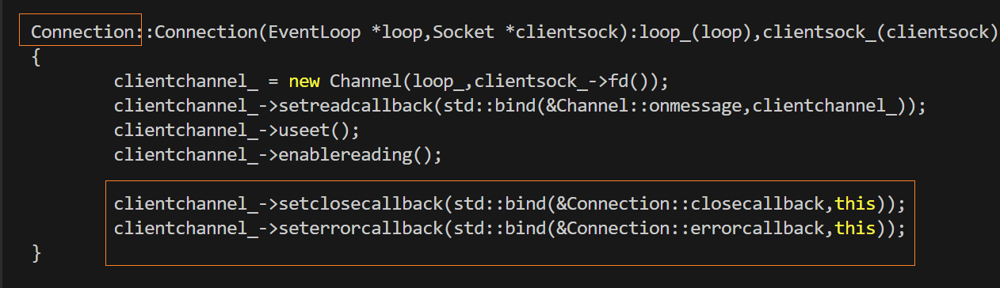
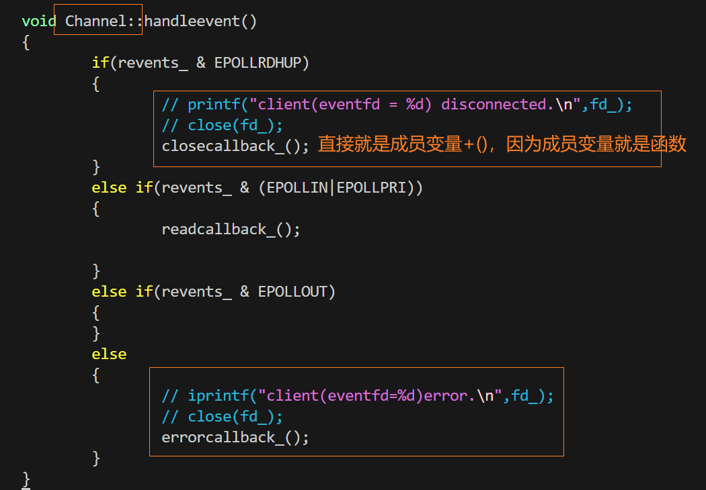
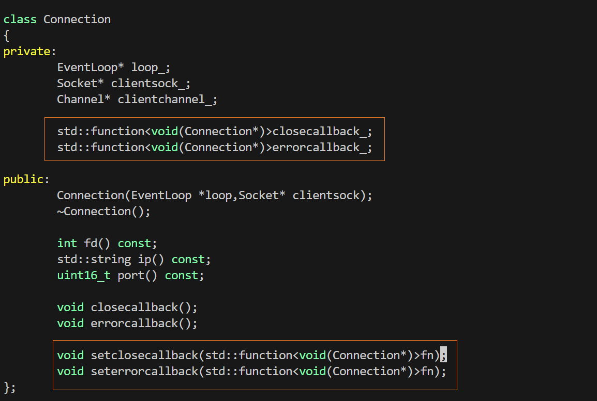
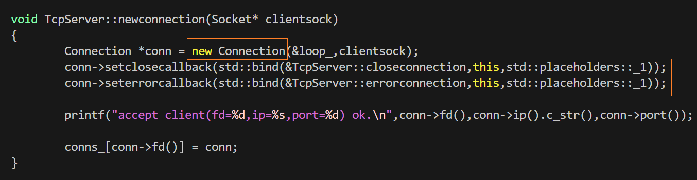
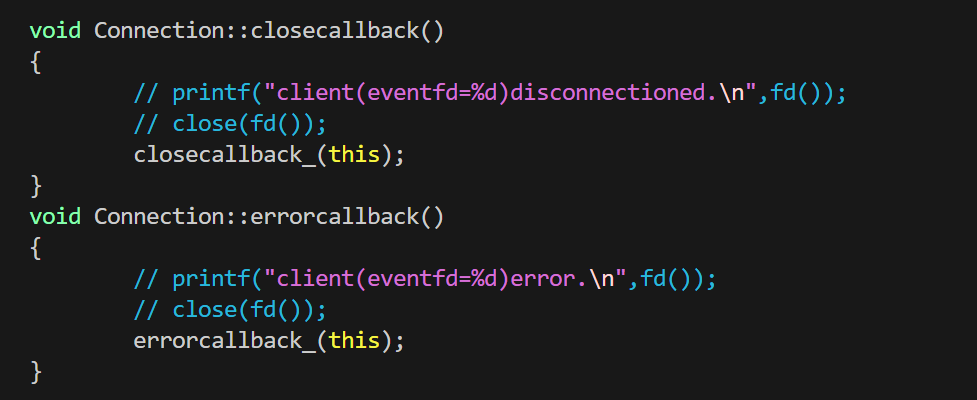

### 在Channel类中回调Connection类的成员函数

解决上节遗留问题，如果某个`Connection`断开，如何处理？

先看谁会接收到断开的信息，是`Channel::handleevent()`函数:




TCP连接断开了或者出错了，能在`Channel`类中释放`Connection`对象吗？并不能，因为`Connection`对象不属于`Channel`,而属于`TcpServer`类，那如何在`Channel`类里释放呢？采用回调函数，提前设置好，需要直接就调用

释放`Connection`类的代码只能写在`TcpServer`类中

`Channel`类是`Connection`类的底层类

`Connection`类是`TcpServer`类的底层类

Tcp连接断开的时候，可以在`Channel`类中回调`Connection`类的成员函数，通过`Connection`类的成员函数，再回调`TcpServer`类的成员函数

（整个释放回调过程与建立回调过程类似，一层层回调）


### step1 ：在Channel类中回调Connection类的成员函数

1. 在`Connection`类中准备两个回调函数

```cpp
void closecallback();
void errorcallback();

void Connection::closecallback()
{
    	// 直接搬Channel里的close代码
        printf("client(eventfd=%d)disconnectioned.\n",fd());
        close(fd()); // 上一节设置的fd()成员函数这次又用上了
}
void Connection::errorcallback()
{
        printf("client(eventfd=%d)error.\n",fd());
        lose(fd());
}
```

2. 在`Channel` 类中声明两个回调函数类型的成员变量，并实现相应的成员函数，用于设置（注册）这些回调函数。



成员函数的函数体很简单，就是把接收到的回调函数`fn`赋值给对应的成员变量(回调函数)

然后在`Connection`的构造函数中设置好回调函数



最后在`Channel`类对应的位置调用回调函数：




### step2 ：在Connection类中回调TcpServer类的成员函数

1. 先在`TcpServer`类中设置成员函数，用于`Connection`回调

```cpp
// 函数体中，要用到参数Connection *conn
void closeconnection(Connection *conn); 
void errorconnection(Connection *conn);

// 以下是最终运行的函数，也是最终被回调执行的函数，位于 TcpServer类里
void TcpServer::closeconnection(Connection *conn)
{
        printf("client(eventfd=%d)disconnectioned.\n",conn->fd());
        // close(conn->fd());
        conns_.erase(conn->fd());
        delete conn;
}
void TcpServer::errorconnection(Connection *conn)
{
        printf("client(eventfd=%d)error.\n",conn->fd());
        // close(conn->fd());
        conns_.erase(conn->fd());
        delete conn;
}
```

在函数中，要移除 map 中的 `Connection`，并且delete 

那为啥不需要 `close(conn->fd())`？因为`delete conn`时，在`~Connection`时，就会关闭，无需重复过程：`delete conn -> ~Connection - >delete clientsock_ -> ~Socket -> close(fd_ )`

这样就实现了：
当一个`Connection`关闭时，会直接析构，当`TcpServer`关闭时，会统一析构正在连接的TCP

下面继续实现回调

2. 在 `Connection` 类中定义两个回调函数成员变量，并提供相应的接口函数用于注册回调。



成员函数具体实现就是将`TcpServer`类回传的 `fn`设置为 成员变量，等待调用

3. 然后在 `TcpServer::newconnection` 函数中，在创建 `Connection` 对象时，将回调函数绑定到 `Connection` 类中的对应回调成员变量。



注意要留一个占位符，预留传参

4. 最后在想要实现`TcpServer::`函数的位置设置回调函数---成员变量+()即可，注意传入参数为`Connection* `,即为`this`指针

