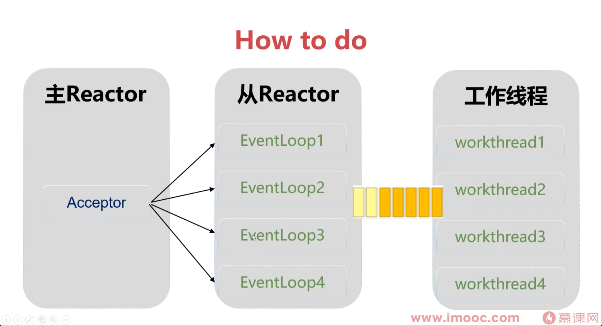
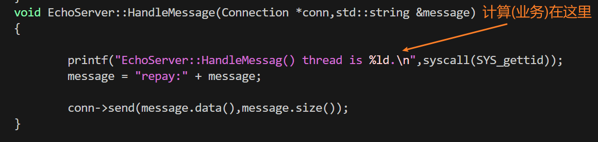

# 增加工作线程(22)

### 1. 当前问题

在“主从 Reactor 多线程模型”中，每个从属 Reactor本质上是一个**单线程运行的事件循环（Event Loop）**。

该 Sub-Reactor 通过 **I/O 多路复用机制** 并发管理多个 `Connection`。对于每个 `Connection`，其处理生命周期通常包含两部分：
1. **I/O 操作（Read/Write）**：基于**非阻塞 I/O**，仅在内核缓冲区和用户空间之间搬运数据，耗时极短，不会阻塞事件循环。
2. **计算操作（Business Logic）**：对读取到的报文进行解析、业务逻辑处理及数据封装。


由于 Sub-Reactor 的事件循环是**单线程串行执行**的，如果某个 `Connection` 的业务计算属于 **CPU 密集型（如复杂计算、大文件压缩）** 或包含 **同步阻塞调用（如查询慢数据库、同步请求外部 API）**，该操作将长期霸占当前 Sub-Reactor 的 CPU 时间片。这会导致事件循环无法继续推进，进而使得分配给该 Reactor 的**所有其他 `Connection` 的就绪事件无法被及时响应**，造成同 Reactor 内全部连接的“假死”或延迟激增。

---

### 2. 深度剖析：为什么会“火烧连营”（阻塞全部连接）？

要理解这个问题，我们需要看透 Event Loop（事件循环）在底层的运行伪代码逻辑：

```cpp
void EventLoop::run()
{
	while(1)
	{
		std::vector<Channel*> channels = ep_->loop();
		// 此处加一个判断，channels是否为空
		// 如果为空，表示超时，回调TcpServer::epolltimeout()
		if(channels.size()==0)
		{
			epolltimeoutcallback_(this);
		}
		else
		{
			for(auto &ch:channels)
			{
				ch->handleevent();	
			}
		}
	}
}
```

假设一个 Sub-Reactor 管理了 A、B、C 三个 `Connection`。
某次 `epoll` 返回时，A 和 B 都有数据可读（都触发了可读事件）。事件循环开始执行步骤 2 的 `for` 循环：

1. **处理连接 A**：调用 `channelA->handleEvent()`。
   * **I/O Read**：非阻塞读取，瞬间完成。
   * **业务计算**：假设连接 A 提交了一个极其复杂的计算任务（比如视频转码，需要耗时 **5 秒钟**）。
   * **问题爆发**：因为整个事件循环就是这**一个线程**，此时这个线程被迫停留在连接 A 的业务代码中，苦苦执行这 5 秒钟的计算。

2. **连接 B 的悲惨命运**：
   * 尽管内核早就把连接 B 的数据准备好了，而且 B 的事件也在 `activeChannels` 列表里等待处理。
   * 但是，因为线程在 A 那里卡了 5 秒，`for` 循环根本无法推进到下一个元素（即连接 B）。
   * 连接 B 被迫等待了 5 秒钟，即使它的业务可能只需要 1 毫秒就能处理完。对于客户端 B 来说，这就表现为“服务器卡顿”或“请求超时”。

3. **连接 C 及后续影响**：
   * 在这 5 秒钟内，如果连接 C 发来了数据，`epoll` 硬件层面会接收数据放入内核态的 TCP 缓冲区。
   * 但是，因为事件循环的线程还没跑完上一次的 `for` 循环，它根本无法回到外层的 `epoller_->poll()`（即 `epoll_wait`）去收割这些新事件。
   * 如果此时涌入大量数据，TCP 接收缓冲区可能会满，导致滑动窗口减小，最终完全拒绝接收数据。

**一句话总结：因为单线程没有任何“分身术”（没有并发执行能力），前一个任务不 `return` 交出执行权，后一个任务就永远得不到执行。**

---

### 3. 业界标准解决方案

正是因为这个痛点，优秀的网络库（如 Muduo、Netty 等）在架构设计上都有严格的规范要求：**绝对不能在 Reactor 线程中执行耗时的业务逻辑！**

如果你确实有耗时的计算需求，应当如何修改现有的模型？

你需要引入 **“计算/工作线程池（Worker Thread Pool）”**，将 Reactor 彻底退化为**纯粹的 I/O 搬运工**。

**升级后的架构工作流：**

1. **IO 处理（在 Sub-Reactor 线程）**：Sub-Reactor 触发 `EPOLLIN`，调用非阻塞 Read 把报文读到 `Buffer` 里。
2. **任务抛出（跨线程通信）**：Sub-Reactor **不处理**报文，而是把报文和对应的 `Connection` 打包成一个 Task，直接丢进一个**专门负责业务计算的 Worker 线程池**的任务队列中。
3. **Reactor 继续循环**：把任务丢出去后（瞬间完成），Sub-Reactor 线程立刻 `return`，继续它的 `for` 循环去处理下一个连接的 I/O 事件。
4. **计算与写回**：Worker 线程池里的某个空闲线程取出任务，花费 5 秒钟算完结果。算完后，**不可在 Worker 线程直接 Write**（跨线程写 socket 容易引发竞态条件），而是将写数据的任务再次排队或者唤醒对应的 Sub-Reactor，让 Sub-Reactor 负责把数据 Write 出去。

这就达成了 **“主 Reactor 负责连接，从 Reactor 负责 I/O，Worker 线程池负责计算”** 的终极高性能高并发网络架构。




### 工作线程的实现

结构：

- **1** 个主线程（Main Reactor）：负责监听端口、接受新连接（Accept）。
- **N** 个 IO 线程（IO Thread Pool）：**复用 ThreadPool 类**，运行 N 个从属事件循环（Sub-Reactor），专门负责非阻塞 I/O 的读写。
- **M** 个工作线程（Worker Thread Pool）：**复用 ThreadPool 类**，专门负责吃 CPU 的业务逻辑计算。

放置位置：




因此，他在`EchoServer`类里，我们补充成员变量`ThreadPool threadpool_;`

具体分析如下：


# 线程池程池部分：


## 宏观架构：三大角色的分工
1. **主线程 (MainLoop/Acceptor)**：**“大堂经理”**
   * 只负责一件事情：监听新客户的到来。一旦有新连接，立刻分配给后边的服务员。
2. **IO 线程池 (SubLoops)**：**“前厅服务员”**
   * 负责接待指定的几个客户。专门负责收发报文（IO操作）。收完报文自己不处理，直接打包扔给后厨。
3. **工作线程池 (WORKS Pool)**：**“后厨厨师”**
   * 专门负责切菜炒菜（耗时的业务逻辑计算）。算完之后再把结果端出去。

---

## 模块拆解笔记

### 1. `ThreadPool` 类（底层的劳动力）
* **职责**：提供源源不断的线程。
* **亮点**：你巧妙地增加了 `threadtype_`（"IO" 或 "WORKS"），这让打印日志时，哪个线程在干什么活一目了然，非常棒的调试技巧！
* **运行机制**：所有线程阻塞在条件变量 `condition_.wait` 上，只要 `taskqueue_` 里有任务，就唤醒一个线程去执行。

### 2. `TcpServer` 类（网络底层框架）
* **职责**：封装底层网络细节，管理主从 Reactor。
* **核心动作**：
  * **初始化时**：创建 1 个 `MainLoop`（主线程跑），并立刻拉起 `N` 个 `SubLoop`（扔进 IO 线程池里跑）。
  * **来新连接时 (`newconnection`)**：
    * 触发 `fd % threadnum_` 算法。这是一个极简且高效的**负载均衡（哈希分配）**算法。
    * 把新建的 `Connection` 绑定到选中的 `SubLoop` 上。从此，这个连接的生老病死（读写断开）全由该 IO 线程负责。
  * **收到消息时 (`onmessage`)**：仅仅是触发回调，把数据往业务层（EchoServer）传，自己绝不碰业务逻辑。

### 3. `EchoServer` 类（业务逻辑层）
* **职责**：定义服务器具体要“干什么”（比如把收到的消息加上 "repay:" 前缀）。
* **核心动作**：
  * 自己单独维护了一个 `threadpool_` (标识为 "WORKS")，这就是**工作线程池**。
  * **收到消息时 (`HandleMessage`)**：
    * 它是被 IO 线程调用的。
    * **关键转折点**：它没有立刻处理消息，而是执行了 `threadpool_.addtask(...)`，把真正的处理函数 `OnMessage` 扔进了工作线程池。
    * IO 线程瞬间解放，立刻回去继续监听其他客户端。
  * **处理消息 (`OnMessage`)**：
    * 这个函数真正运行在 **WORKS 工作线程** 中。
    * 完成字符串拼接等计算任务，调用 `conn->send()` 发送。

---

## 动态执行流笔记 (一条消息的奇幻漂流)

假设客户端发来一条消息 `"Hello"`，你的代码是这样运转的：

1. **[IO 线程]** 底层 epoll 发现有数据可读。
2. **[IO 线程]** `Connection` 读取出 `"Hello"`。
3. **[IO 线程]** 顺着回调链条一路向上调用：`TcpServer::onmessage` -> `EchoServer::HandleMessage`。
4. **[IO 线程]** 在 `HandleMessage` 中，把包裹 `[执行OnMessage(conn, "Hello")]` 扔进了 `WORKS` 线程池的任务队列。
5. **[IO 线程]** `HandleMessage` 执行完毕，IO 线程回到 epoll_wait，继续监视。
   *(此时 IO 线程的工作结束，耗时仅微秒级)*
6. **[WORKS 线程]** 某个空闲的 WORKS 线程被唤醒，从队列取出任务。
7. **[WORKS 线程]** 执行 `OnMessage`，拼接出 `"repay:Hello"`。
8. **[WORKS 线程]** 调用 `conn->send()`，把数据发回客户端。任务结束，继续沉睡。

---

## ⚠️ 代码细节修正提醒 (重要)

你的代码逻辑已经跑通了，非常牛！但作为导师，我必须指出你 `ThreadPool.cpp` 中的一个隐患（我们之前提到过，你可能忘了改）：

**在 `ThreadPool::ThreadPool` 构造函数中：**

```cpp
// 你的代码：
while(stop_==false)  // <--- 这里有 bug ！
{
    // ...
    // 判断是否打烊了
    if((this->stop_==true) && (this->taskqueue_.empty()==true)) {
        return;
    }
    // ...
}
```
**隐患分析**：
当析构函数调用 `stop_=true` 时，如果此时任务队列里还有 100 个任务没做完。当前任务做完后，一回到 `while(stop_==false)`，循环条件不成立，**线程直接退出，剩下 99 个任务全部丢失！** 这会导致所谓的“不优雅退出”。

**修改方案**：
必须改成死循环，让里面的 `if` 来决定什么时候退出：
```cpp
while(true)  // 必须改为 true 
{
    // ...
    // 只有当 stop 为 true，且任务全都做完了，才允许退出！
    if((this->stop_==true) && (this->taskqueue_.empty()==true)) {
        return;
    }
    // ...
}
```


## 为什么不能把IO 线程池和业务计算线程池放在一块？


**“既然都要用多线程，为什么非要搞‘IO 线程池’和‘业务线程池’两套？把它们合并成一个超级线程池，不管什么任务都往里扔，不是更省事吗？”**

答案是：**技术上完全可以，但在高并发场景下，这会引发一场“灾难”。**

我们可以用一个极其形象的**“餐厅模型”**来理解，同时从技术底层剖析原因。

### 1. 形象比喻：餐厅的“服务员”与“厨师”

- **IO 线程 = 餐厅服务员**：负责接待客人、点菜、上菜（处理网络连接、收发数据包）。动作极快，不能耽搁。
- **业务线程 = 后厨厨师**：负责炒菜、炖汤（处理耗时的数据库查询、视频转码等业务逻辑）。动作慢，需要花时间。

**如果你把它们合并成一个池子（也就是让所有员工既当服务员又当厨师）：**
假设你有 8 个员工。现在同时来了 8 桌客人，点名要吃“佛跳墙”（耗时 5 秒的复杂计算）。你的 8 个员工一看，立马拿着菜单冲进后厨，全神贯注地开始炖汤。
**后果是什么？**
在这 5 秒钟内，**餐厅大堂里空无一人！** 就算第 9 桌客人只是想进来买瓶水（耗时 1 毫秒的极快请求），他也找不到人理他，只能在门口死死排队，甚至愤怒地离开（连接超时）。更可怕的是，门外的客人越聚越多（TCP 缓冲区塞满），餐厅彻底瘫痪。

**如果是分离模式（比如 2 个服务员 + 6 个厨师）：**
8 桌客人点完“佛跳墙”，2 个服务员立刻把订单（Task）扔给后厨的 6 个厨师。虽然厨师不够用，后厨发生了排队，但是**大堂里永远有 2 个服务员在飞速运转！** 第 9 桌客人来买水，服务员瞬间就能处理完收钱交货。系统依然是**高度可用**的。

------


### 2. 回到技术底层：为什么绝不能合并？

在 C++/Java 的高性能网络编程（如 Netty, muduo, Redis6）中，严格区分 IO 线程和业务线程有以下三大硬核原因：

#### 原因一：防止“线程池耗尽”导致整个网络瘫痪（雪崩效应）

如果你只有一个混合线程池（比如 10 个线程），当遭遇突发的**耗时请求**（比如复杂的 SQL 查询卡顿了）时，这 10 个线程可能全被派去执行业务逻辑了。
此时，**谁来调用 epoll_wait 处理新连接？谁来读取网卡里刚收到的数据？** 答案是：没有线程了。
一旦底层的 IO 读取停止：

1. TCP 接收缓冲区迅速填满。
2. 操作系统开始丢弃客户端发来的数据包。
3. 客户端大面积超时断开。
   **仅仅因为几个耗时的业务，导致整个服务器的“网络通信”直接断网，这就是架构设计上的雪崩。**

#### 原因二：两者对“线程数量”的配置要求完全相反

- **IO 线程池**：它的任务是纯内存操作（从内核拷数据、解析协议），基本**不会阻塞**。这种线程的特点是 CPU 密集型。最佳的线程数量通常是 **等于 CPU 核心数**（比如 4 核机器配 4 个 IO 线程）。线程多了反而会因为上下文切换导致性能下降。
- **业务线程池**：它的任务通常包含阻塞操作（等待数据库响应、磁盘读写、RPC 调用）。因为线程经常处于“休眠等待”状态，为了提高吞吐量，线程数量往往需要配置得比较大（比如 **50 到 200 个线程**）。
  **如果合并：** 你到底配置多少个线程？配置 4 个，稍微遇到点数据库阻塞系统就卡死了；配置 200 个，成百上千个线程去抢夺 IO 资源，CPU 大量时间浪费在线程切换上，网络性能直接暴跌。

#### 原因三：无锁化设计（Lock-free）的破坏

高性能 Reactor 架构（如 One Loop per Thread）有一个精妙的设计：**一个特定的网络连接（比如 Connection A），它的所有 IO 读写，永远只由固定的一个 IO 线程来负责。**
因为只有一个线程在操作 Connection A，所以在这个连接的发送队列、接收缓冲区的管理上，**完全不需要加锁！**

如果你用一个混合线程池：
上一秒，线程 1 从连接 A 读了数据；下一秒，业务处理完了，线程 2 准备往连接 A 发送数据；同时线程 3 可能又收到了连接 A 的关闭信号……
多个线程同时操作同一个 Socket 及其缓冲区，你就**必须处处加锁**。在极高并发下，锁竞争带来的性能损耗是致命的。

### 总结

合并线程池看似省事，实则是把**“轻量级的网络通信”**和**“重量级的业务计算”**强行绑定在了一起。

- **IO 线程池**就像是服务器的**心跳和呼吸**，必须时刻保持畅通，绝对不能被任何慢动作卡住。
- **业务线程池**则是服务器的**消化系统**，慢一点没关系，排队慢慢消化就行。

把呼吸和消化分开，才是一个健壮、能扛住高并发的高性能服务器架构！


